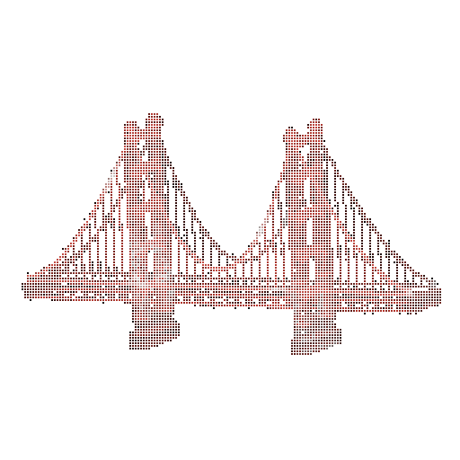
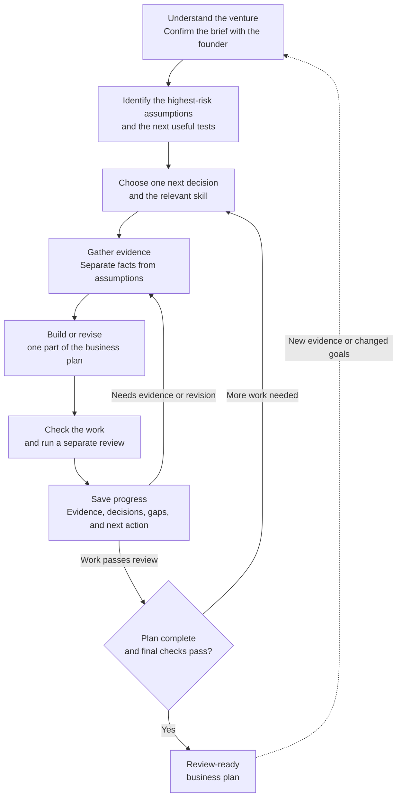

  

  Your bridge from idea to reality.

  
  

  <a href="#overview">Overview</a> &middot;
  <a href="#architecture">Architecture</a> &middot;
  <a href="#special-thanks">Special thanks</a> &middot;
  <a href="LICENSE">License</a>

## Overview

Building a business plan is largely information work: searching, organizing, and
validating what is known. Much of it is repetitive—and can be automated.
Founders should spend less time assembling a document and more time improving
the plan: testing product assumptions, learning from customers, and getting out
into the world to build something that matters.

That is why we built Venture: an entrepreneurship harness that brings focused
skills, a repeatable workflow, persistent venture context, and verification
together to deliver an evidence-backed business plan. Think of it as a startup
factory—a system that helps founders move from idea to informed action, so they
can spend their time iterating, experimenting, and building.

Actionable [Agent Skills](https://agentskills.io/) teach an agent how to make
venture decisions, gather evidence, create decision artifacts, and validate
the results.

For setup and detailed operating guidance, see the [harness guide](docs/harness.md).

The catalog includes 28 skills with task-specific workbooks, explicit research
stages, worked examples, and financial and operational checks. Existing venture
workspaces can be upgraded with the [v2 migration](docs/harness.md#upgrading-an-existing-workspace).

For the public landing-page proposal, local preview, and GitHub Pages publishing
steps, see [the website guide](site/README.md).

## Architecture

Venture develops a plan through a repeating cycle, not a single prompt. The
founder confirms the direction, and the agent works on one decision at a time,
revisiting it when evidence or review exposes gaps.

Saved progress lets work pause and resume, including when a task is blocked.
New evidence can reopen earlier decisions. A **review-ready** plan has passed
the workflow's checks and review; it is not proof that the business will succeed.

## Special thanks:

- **Bill Aulet**, for [*Disciplined Entrepreneurship: 24 Steps to a Successful Startup*](https://www.d-eship.com/), which inspired the entrepreneurship workflows.
- **WalkingLabs**, for the [Learn Harness Engineering course](https://walkinglabs.github.io/learn-harness-engineering/en/), which informed the harness design.
- **edgar**, for [A Tour of the Harness](https://vespassassina.github.io/edgar/), a guided exploration of agent harness design.
- [Agent Skills specification](https://agentskills.io/specification)
- [GitHub Copilot Agent Skills documentation](https://docs.github.com/en/copilot/how-tos/copilot-cli/customize-copilot/add-skills)

## License

Venture is available under the [MIT License](LICENSE).
